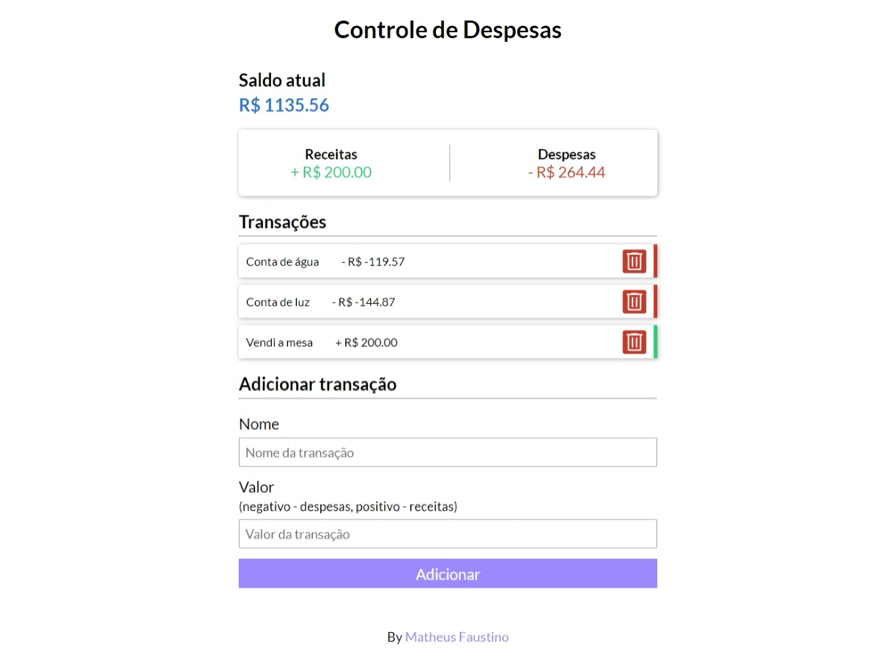

# Controle de despesas

Um projetinho bem legal sobre controle de despesas, com o layout e cores totalmente copiado desse [vídeo](https://youtu.be/xarRciYWT5Q), mas o código em JavaScript eu mesmo que fiz.

Veja [aqui](https://controle-de-despesas-pi.vercel.app/)

## Techs

- HTML
- CSS
- JavaScript
- [Vite](https://vitejs.dev/)
- GIT

## Contato 

- Acesse também meus outros repositórios no [Github](https://github.com/matheusfdosan)
- Também me siga no [Instagram](https://instagram.com/matheusfdosan)
